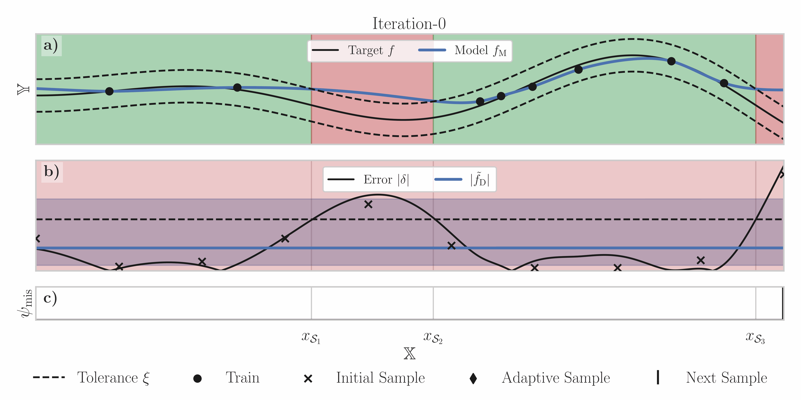

<div align="center">

# Quantifying Local Model Validity using Active Learning

<h4 align="center">
  <a href="https://trustinai.github.io/LocalModelValidity/" target="_blank">Home</a> |
  <a href="https://github.com/SvenL13/LocalValidity/blob/master/localval/local_validation_AL.ipynb" target="_blank">Tutorial</a> |
  <a href="https://doi.org/10.48550/arXiv.2406.07474" target="_blank">Research Paper</a>
</h4>

</div>

This repository contains an implementation of the method described in the paper 
[Quantifying Local Model Validity using Active Learning](
https://doi.org/10.48550/arXiv.2406.07474). The tutorial ([local_validation_AL.ipynb](https://github.com/SvenL13/LocalValidity/blob/master/localval/local_validation_AL.ipynb)) shows 
the usage together with the `BoTorch` framework.



## Installation
You can install the requirements via `pip`:

```
pip install -r requirements.txt
```

## Citation

If this repo helped your research, I would appreciate you citing:
```
@inproceedings{
laemmle2024quantifying,
title={Quantifying Local Model Validity using Active Learning},
author={Sven L{\"a}mmle and Can Bogoclu and Robert Vo{\ss}hall and Anselm Haselhoff and Dirk Roos},
booktitle={The 40th Conference on Uncertainty in Artificial Intelligence},
year={2024},
url={https://openreview.net/forum?id=muDcwOKf50}
}
```
